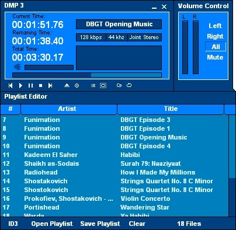



## Dynamic Media Player 3 \(ALPHA 1\)

### Description

Plays an extremely large ammount of digital audio and video files. Supports almost every popular media type. Including: Full MPEG support (Including MP3), All windows file types (wav, avi, etc), MIDI, UNIX. Also, DMP3 fully supports M3U playlists, PLS Playlists, and its own, script based, DPL Playlists.
 
### More Info
 
Files

Plays an extremely large ammount of digital audio and video files. Supports almost every popular media type. Including: Full MPEG support (Including MP3), All windows file types (wav, avi, etc), MIDI, UNIX. Also, DMP3 fully supports M3U playlists, PLS Playlists, and its own, script based, DPL Playlists.

Probably one of the best looking and sounding media programs on PSC, not to mention the large ammount of supported file types.

Great sounding / looking audio and video

None that I know of

             |
---                |---
**Submitted On**   |2002-07-30 13:35:38
**By**             |[Paranoid\_Android](https://github.com/Planet-Source-Code/PSCIndex/blob/master/ByAuthor/paranoid-android.md)
**Level**          |Intermediate
**User Rating**    |5.0 (10 globes from 2 users)
**Compatibility**  |VB 5\.0, VB 6\.0
**Category**       |[Sound/MP3](https://github.com/Planet-Source-Code/PSCIndex/blob/master/ByCategory/sound-mp3__1-45.md)
**World**          |[Visual Basic](https://github.com/Planet-Source-Code/PSCIndex/blob/master/ByWorld/visual-basic.md)
**Archive File**   |[Dynamic\_Me1126197302002\.zip](https://github.com/Planet-Source-Code/paranoid-android-dynamic-media-player-3-alpha-1__1-37410/archive/master.zip)

### API Declarations

MANY!

